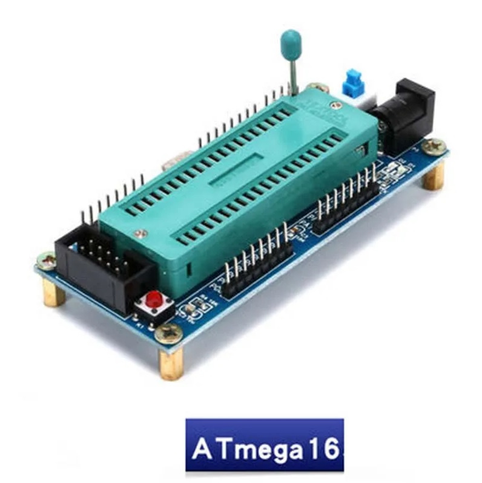

# 🚀 ATmega16 & ATmega32 Programming Module

✨ A versatile development board for ATmega16 and ATmega32 microcontrollers with convenient features for prototyping and programming. ✨

## 🔥 Key Features

- **🔌 Full IO Access**: All 23 I/O pins routed out for easy connection
- **🛠️ Classic ATmega16 System**: Ready-to-use, no soldering required
- **⏱️ Interchangeable Crystal**: 
  - Comes with 8MHz oscillator installed
  - 🔄 Round hole socket for easy replacement
- **⚡ Flexible Power Options**:
  - 🔋 ISP port programming power
  - 🔌 External power via DC-005 (5.5×2.1mm) socket
- **💡 Debugging LEDs**: 4 status LEDs for development and testing

## 📊 Technical Specifications

| Specification        | Details                                  |
|----------------------|------------------------------------------|
| 💻 Compatibility        | All DIP-40 ATmega chips (ATmega16/32)    |
| 🔌 Programming Port     | Standard ISP interface                   |
| 💡 Indicators          | Power & programming status LEDs          |
| ⏱️ Crystal Oscillator  | 8MHz (user-replaceable)                  |
| ⚡ Power Supply        | Multiple options:                        |
|                     | - 🔋 DC-005 5.5×2.1mm jack                  |
|                     | - 🔌 ISP programming port                   |
|                     | - 🔋 4 pairs of VCC/GND pins                |
| 🎛️ Controls            | Reset button                             |
| 📏 Dimensions          | 90 × 40 × 21mm (L × W × H)              |
| ⚖️ Weight              | 43g                                      |

## 📦 Package Contents

1. 🧩 ATmega16/32 development board
2. ⏱️ 8MHz crystal oscillator (pre-installed)
3. 📄 Documentation sheet

> 💡 **Pro Tip**: The board comes ready-to-use with 8MHz crystal, but you can easily replace it with any other frequency as needed for your project!

## 🛠️ Suggested Uses
- 🧪 Electronics prototyping
- 🎓 STEM education
- 🤖 Robotics projects
- 💡 IoT development
- 🔌 Embedded systems learning

## 🌟 Why Choose This Board?
✅ Plug-and-play design  
✅ Beginner friendly  
✅ Professional grade quality  
✅ Versatile power options  
✅ Easy chip replacement  

#HappyCoding! 🎉