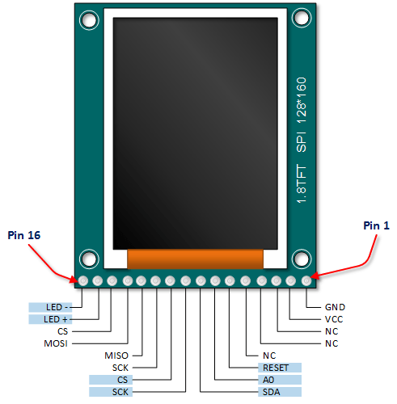
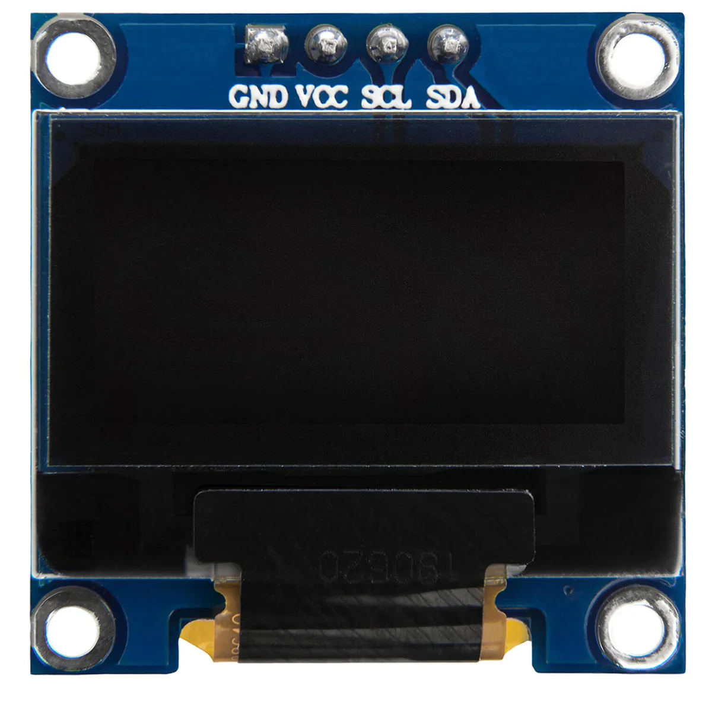
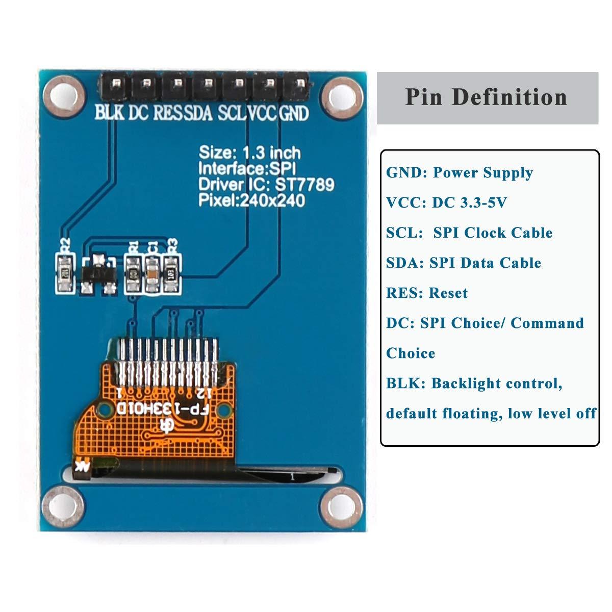
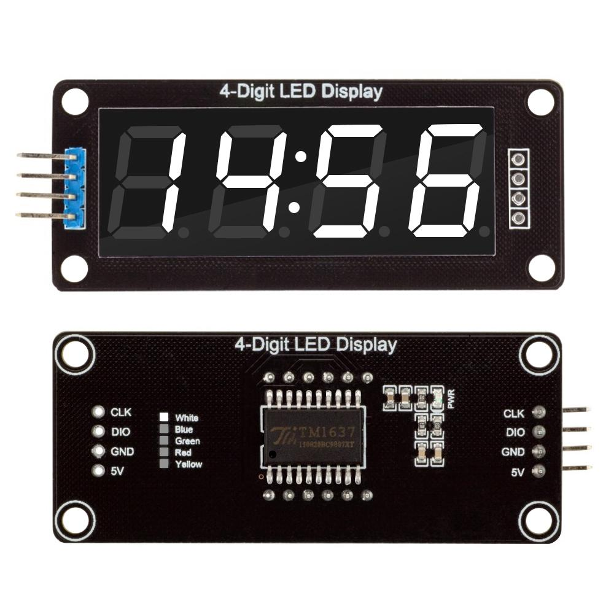
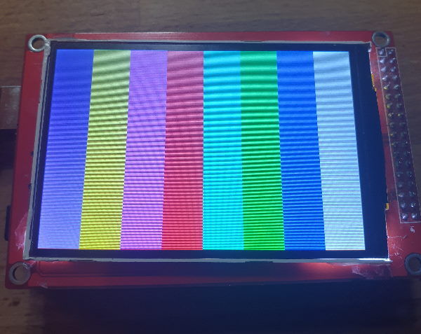
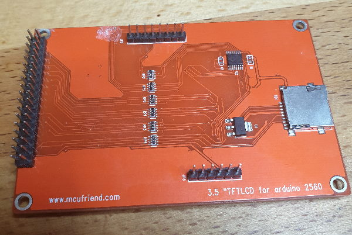

# Displays

This directory contains display modules, drivers, and example code for various display technologies.

See [wiring.md](wiring.md) for general display wiring and notes.

## Contents

### 1,7_SPI_128x160_OLED_ST7735
1.7" SPI 128x160 OLED display module using ST7735 controller. Includes pinout diagrams and documentation.
 

### gm12864
GM12864 GLCD module (128x64) using ST7567S controller. Includes ESP32 example code.

### HD44780
Standard HD44780 character LCD displays (16x2, 20x4, etc.). Contains:
- Interface examples for STM8
- Library implementations
- Circuit diagrams and documentation

### HITACHI LM032XMBL
Hitachi LM032XMBL LCD module datasheet.

### Money_Detector_Display_TM1621
TM1621-based display module example code.

### Nokia LCD5110 (PCD8544)
Nokia 5110 LCD display (84x48 pixels) using PCD8544 controller. Contains:
- Arduino libraries and examples
- STM32 SPI implementations
- Pinout diagrams
 

### SSD1306
SSD1306 OLED display modules (128x64, I2C/SPI). Includes:
- Arduino libraries
- Embeetle logo data
- Documentation
 

### st7789
ST7789 TFT display module documentation.
 

### TM1637
TM1637 4-bit digital tube LED clock display module. Includes datasheet and examples for Arduino.
 

### UTFT
UTFT library for Arduino Mega and large TFT displays. Contains:
- PlatformIO examples
- Embeetle port
- Hardware images
 

