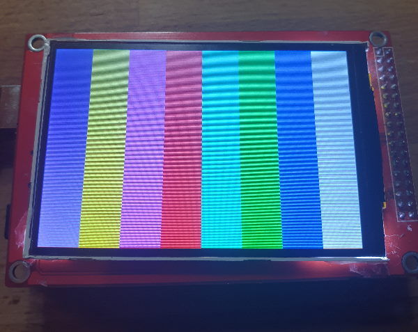
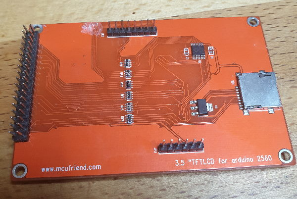

UTFT
====

The only working UTFT driver for `mcufriend 3.5 TFT` Display
### Images




### Configuration
```c++
// Uncomment the next line for Arduino Mega
UTFT myGLCD(ITDB32WC, 38, 39, 40, 41);
```

