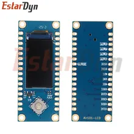

# ESP32-C3 Core Board (with Display)

This directory contains resources for the ESP32-C3 Core Board, typically featuring an onboard display.

See [wiring.md](wiring.md) for wiring and programming details.

## Features
- **MCU**: ESP32-C3 (RISC-V single-core, 160MHz)
- **Connectivity**: 2.4GHz Wi-Fi and Bluetooth 5 (LE)
- **Onboard**: 2.4G PCB Antenna
- **Pins**: 32-pin header format

