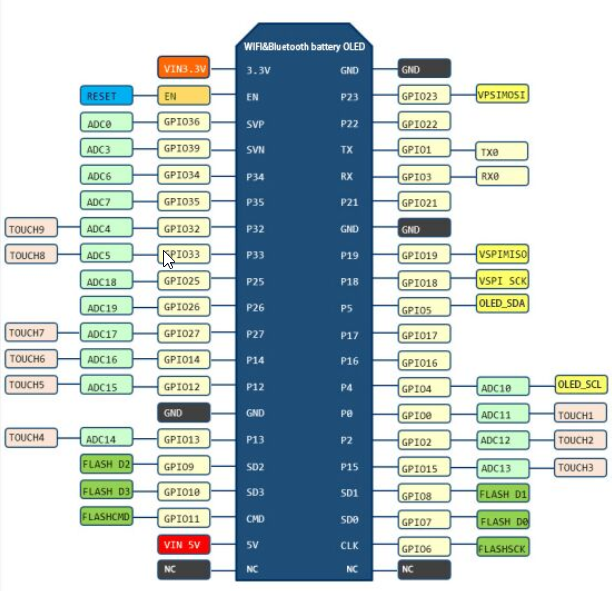

# TTGO ESP32 with 18650 Battery & OLED

See [wiring.md](wiring.md) for wiring and programming details.

# Features

* ESP-WROOM-32 Module (Wifi, Bluetooth, two cores)
* USB to serial bridge with Silicon Labs CP210X Chip
 (supported by Windows and Linux)
* Charge Circuit for an 18650 battery (backside of board)
* OLED display (SSD1306 or compatible) I2C version
* LED on GPIO16
* power switch

http://www.areresearch.net/2018/01/how-to-use-ttgo-esp32-module-with-oled.html
https://daniel-strohbach.de/esp32-oled-battery-thing

Needs Library
https://github.com/ThingPulse/esp8266-oled-ssd1306
and TimeLib

# Product Description:

When you do some ESP32 projects you must hate to add a power bank to provide the power. This tiny board could solve such problems.
A 3000mAH 18650 battery could make ESP32run 17 hours or more.
18650 charging system integrated.
Indicate LED inside(Green means full& Red means charging)
Charging and working could be at the same time.
1 Switch could control the power.
1 extra LED could be programmed(Connected with GPIO16[D0])
0.5A charging current
1A output
Over charge protection
Over discharge protection
Full ESP32 pins out

# battery level

float batteryLevel = map(analogRead(33), 0.0f, 4095.0f, 0, 100);

chip TP5410

# ARDUNIO

* Board: ESP32 Dev Module

# HARDWARE

LED =  GPIO16
bootButton = 0

# scematic

<https://www.espressif.com/en/products/hardware/esp32-devkitc/resources>

# OLED

Unlike on other ESP32 boards with OLEDs, the OLED's I2C SDA and SCL pins are connected as follows:

* SCL - Pin 4
* SDA - Pin 5

```
SSD1306Wire display(0x3c, OLED_SDA, OLED_SCL);
```
It does not require an "enable" signal on GPIO16 as suggested in some programs I found. So comment these out if you see them.

# Pinout



# Upload

* turn off
* hold boot putton
* wait for upload
* turn on
* release boot button

2 option

* just holding boot button
* release on upload process

# HARDWARE

```c
#define KEY 0
#define LED 16
SSD1306Wire display(0x3c, 5, 4, GEOMETRY_128_64);
```


## Platformio
```ini
[env:d-duino-32]
platform = espressif32
board = d-duino-32
framework = arduino
lib_deps = thingpulse/ESP8266 and ESP32 OLED driver for SSD1306 displays@^4.6.1
```