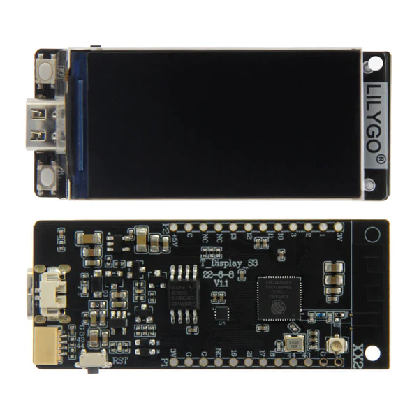

# Specifications
* MCU 	ESP32-S3R8 Dual-core LX7 microprocessor
* Wireless Connectivity 	Wi-Fi 802.11, BLE 5 + BT mesh
* Programming Platform 	Arduino-ide、 Micropython
* Flash 	16MB
* PSRAM 	8MB
* Bat voltage detection 	IO04
* Onboard functions 	Boot + Reset + IO14 Button
* LCD 	1.9" diagonal, Full-color TFT Display
* Drive Chip 	ST7789V
* Resolution 	170(H)RGB x320(V) 8-Bit Parallel Interface
* Working power supply 	3.3v
* Support STEMMA QT / Qwiic, JST-SH 1.0mm 4-PIN
* Connector 	JST-GH 1.25mm 2PIN

## esptool

```bash
> python -m esptool flash_id

esptool.py v4.8.1
Found 1 serial ports
Serial port COM9
Connecting...
Detecting chip type... ESP32-S3
Chip is ESP32-S3 (QFN56) (revision v0.1)
Features: WiFi, BLE, Embedded PSRAM 8MB (AP_3v3)
Crystal is 40MHz
MAC: 68:b6:b3:22:f0:98
Uploading stub...
Running stub...
Stub running...
Manufacturer: ef
Device: 4018
Detected flash size: 16MB
Flash type set in eFuse: quad (4 data lines)
Flash voltage set by eFuse to 3.3V
Hard resetting via RTS pin...
```