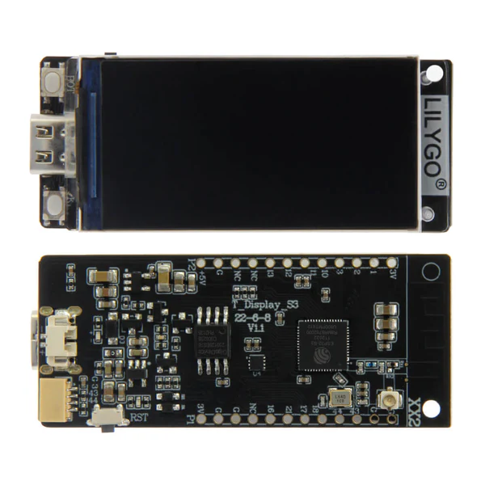

# ESP

This directory contains ESP32 and ESP8266 development boards, projects, and resources.

See [wiring.md](wiring.md) for general ESP wiring and programming notes.

## All ESPs

* <a href="HELTEC"> Heltec WiFi Kit 8 <br/></a>

* <a href="ESP32TTGO-OLED-18650">ESP32TTGO-OLED-18650 <br/></a>

* <a href="muselab"> esp32 c6 muse lab <br/></a>

* <a href="T-Display-S3">T-Display-S3 <br/></a>

* <a href="Wemos-32-With-OLED">Wemos with Display<br/></a>

* <a href="TTGO">TS V1.0 Esp32 1.44 TFT Display<br/></a>

## With external antenna (commodore project)

* <a href="Commodore-board">Commodore board project</a>

## Links
* https://github.com/Xinyuan-LilyGO/T-Display-S3

## esptool
```bash
> python -m esptool flash_id

esptool.py v4.8.1
Found 1 serial ports
Serial port COM7
Connecting....
Detecting chip type... Unsupported detection protocol, switching and trying again...
Connecting..........
Detecting chip type... ESP32
Chip is ESP32-D0WDQ6 (revision v1.0)
Features: WiFi, BT, Dual Core, 240MHz, VRef calibration in efuse, Coding Scheme None
Crystal is 40MHz
MAC: 40:22:d8:03:a8:00
Uploading stub...
Running stub...
Stub running...
Manufacturer: 5e
Device: 4016
Detected flash size: 4MB
Flash voltage set by a strapping pin to 3.3V
Hard resetting via RTS pin...
```
