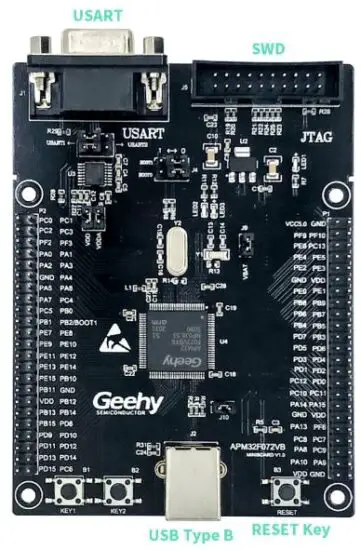

# Geehy APM32F072VB Mini Board

## Performance

* 32 bit Arm® Cortex® M0+
* Max frequency: 48MHz
* Flash: 128KB
* SRAM: 16KB

## Interface and Resources

* USB: 1 (Type B)
* SWD: 1
* LED: 2
* KEY: 2
* RESET KEY: 1
* GPIO: 81
* USART: 1 (Switch to USART1 or USART2 by jumper)

## Start

* Ensure a solid connection for jumper J6, J8, J9 and J10.
* Connect the USB in development board with PC by a USB Type B cable and power the development board.
* Connect the emulator with SWD interface for MCU programming and debugging.

## System Requirements

* Windows OS (7/8/10)

## Development Tool

* Keil: MDK ARM

## Appearance

