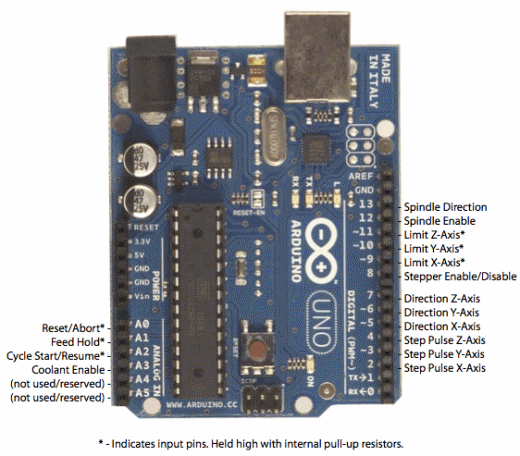

# Arduino CNC Shield (GRBL compatible)

**Short description**
Standard Arduino CNC Shield compatible with stepper driver modules (A4988/DRV8825) and GRBL control. See pinout image for stepper motor and limit switch connections.

**Wiring**
See `wiring.md` in this folder for typical stepper driver wiring and microstep jumper settings.

**Files**
- `arduino-cnc-shield-pinout.png` (pinout)
- `Arduino-CNC-Shield-Scematics-V3.XX_.jpg` (schematic)

**Notes**
- Confirm the stepper driver orientation and adjust microstep jumpers for your motor current requirements.