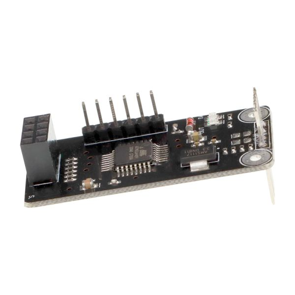

Details
    This is a platform using the ATMEGA48 to help you using the NRF24L0 Module easily. It uses the I2C (TWI) communication protocol to communicate with other controller such as the Arduino thus to simplify the NRF24L01 communication. With this module, you do not need to understand the tedious communication process of NRF24L01 anymore, building NRF24L01 wireless application would be much easily. Also Demo on Arduino platform would help you learning how to use this module in detail.
Features

    I2C communication with Arduino (address 35)
    Small frame with length 73mm,width 22mm.
    Smooth bidirectional communication, slave or master.
    Maximum transmit distance can reach 70m(Just for reference)
    I2C/TWI protocol simplifies the communication greatly.
    Compatible with Arduino perfectly.

## Links
https://www.14core.com/nrf24l01-i2ctwi-2-wire-interface-communication-shield-setup-guide/
https://blog.optman.net/nrf24l01-spi-to-i2c-2/