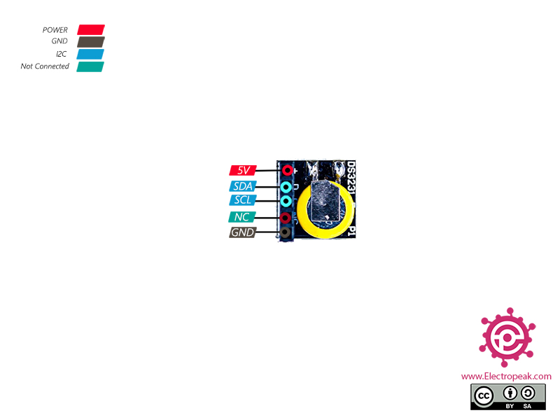

# Modules

This directory contains various electronic modules, breakout boards, and interface modules.

Many module folders include a `readme.md` and a `wiring.md` file.

See the root [wiring.md](wiring.md) for general module wiring notes.

## Contents

### 8x8 RGB board
8x8 RGB LED matrix board with schematics.

### A3967
A3967 EasyDriver stepper motor driver module with datasheet and pinout diagram.
 

### AD9833
AD9833 DDS (Direct Digital Synthesis) signal generator module for generating sine/square waves.

### battery modules
Collection of battery management and charging modules:
- Multi-cell BMS (2S, 3S, 4S) with Type-C charging
- Single-cell protection and charging modules
- Battery capacity indicators
- Power bank DIY boards
- UPS modules for Raspberry Pi Pico

### CC1101
CC1101 low-power sub-1 GHz RF transceiver module. Includes application notes and documentation.

### cjmcu-2232hl
CJMCU FT2232HL USB-to-multi-protocol converter module (USB-to-SPI/I2C/GPIO). Contains MPSSE examples and I2C test code.

### CNC Shield
Arduino CNC shield for controlling stepper motors in CNC applications. Includes pinout and schematic.
 

### CP2102
CP2102 USB-to-UART serial converter module.
 

### CP2112
CP2112 USB-to-I2C bridge module.

### DS3231
DS3231 real-time clock (RTC) module with battery backup. Includes pinout diagrams and examples.
 

### E07-M1101D-CC1101
E07-M1101D CC1101-based LoRa module with SMA antenna connector.

### EEPROM I2C
I2C EEPROM modules (24C series compatible).

### INA3221
INA3221 triple-channel current/power monitor module.

### l9110
L9110 dual H-bridge motor driver module.

### LR1262 LoRaWAN
LR1262 LoRaWAN node module based on SX1261/2 chips.

### MAX7219 dot display
MAX7219 LED dot matrix display driver modules. Includes datasheet and pinout diagrams.

### MH-CD42
MH-CD42 power bank charging module for 18650 batteries.

### Miniature FM Stereo Radio Module for Arduino RDA5807M
RDA5807M FM stereo radio receiver module.

### NRF24L01 Wireless Shield SPI to I2C Interface for Arduino
NRF24L01 2.4GHz RF module with SPI-to-I2C interface shield for easier Arduino integration.

### PCF8574 I2C pin expander
PCF8574 I2C GPIO expander module (8-bit I/O port).

### SI5351 clock generator
SI5351 programmable clock generator module for generating multiple clock signals (8 kHz to 160 MHz).

### UMFT200Xd
UMFT200X USB-to-FTDI module documentation and drivers.

### VS1053B MP3
VS1053B MP3 audio decoder module with SD card support.
 

### WIN668 Bluetooth
WIN668 Bluetooth module documentation and resources.

### xkt-412
XKT-412 component/module.

### YS-CH341T
YS-CH341T USB-to-UART converter module based on CH341T chip.

