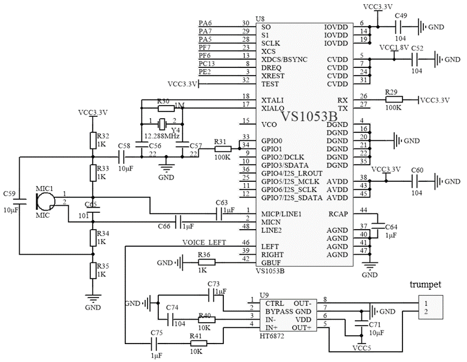

# VS1053B MP3 Decoder Module

**Short description**
VS1053B-based MP3 codec module with SPI control, line-in, headphone/line-out and microphone input. Suitable for audio playback projects with microcontroller control via SPI.

**Wiring**
See `wiring.md` in this folder for SPI wiring (MOSI/MISO/SCLK/CS and DREQ/RESET lines) and typical audio connections.

**Files**
- `The-Circuit-Connection-of-VS1053B.png` (wiring diagram)
- `vs1053.pdf` (datasheet)

**Notes**
- Ensure correct logic levels (3.3 V recommended) and check DREQ pin for data flow control.