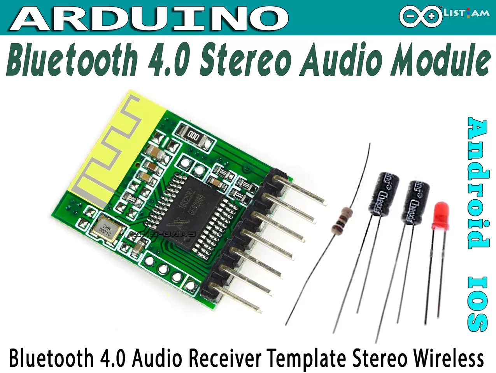

Win668 Bluetooth 4.0 Stereo Wireless Audio Module Усилитель (arduino)

Description
Report Item

The Bluetooth audio module is a pure audio receiving module with Bluetooth version 5.0 and stereo output. The built-in Bluetooth antenna has a simple structure. The power supply voltage can be 3.7V from lithium battery or 5V from regulated power supply (with anti reverse connection function). It can be used as a common power amplifier and active speaker to add Bluetooth connection function. The 7pin output interface is a through hole with a spacing of 2.54. The 7pin output interface is: power +, ground, left channel, right channel, mute, LED status indication, key external key port. Among them, the LED status port is externally connected with a 100 ohm resistor in series LED indicating that it is connected to the ground. When Bluetooth is not connected, it will flash. After Bluetooth is connected successfully, it will flash slowly

Volume: 25mm x 19mm x7mm

