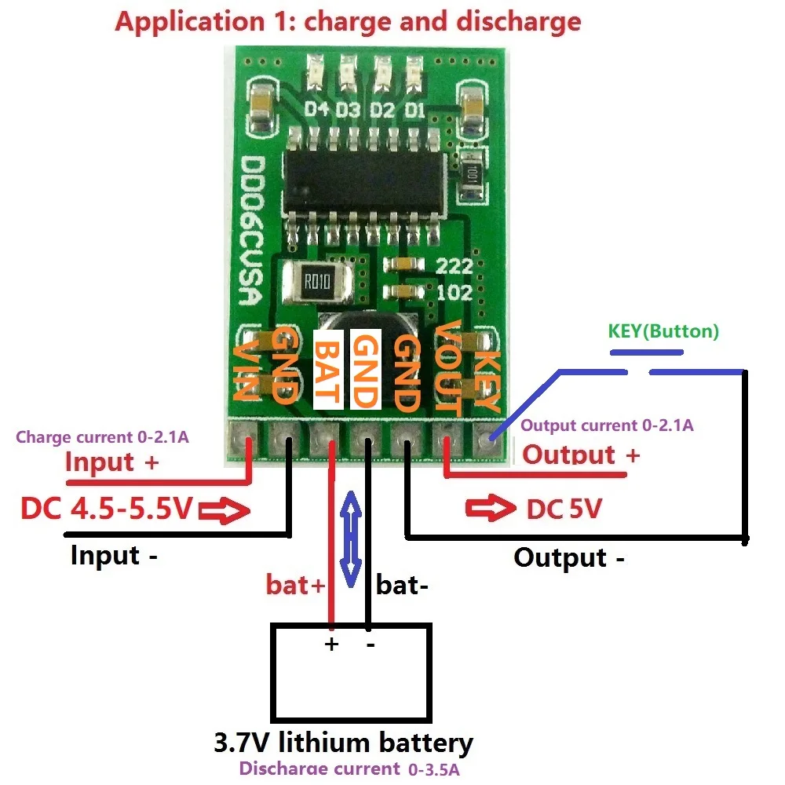

# DC 5V 2.1A Mobile Power Module (DD06CVSA)

**Short description**
Multifunctional mobile power module with charging, boosting (step-up), battery protection and level indication. Ideal for DIY power banks and portable devices using a single Li‑ion cell. 
4 in 1 charge/Discharger(boost)/battery protection/Battery level indicator modules
 
DD06CVSA is a multifunctional 3.7V/4.2V Mobile Power Diy  module,3 in 1 Function: charge,discharge and battery protection.
It is very suitable for DIY mobile power.
 
Charge voltage : DC 4.5V-5.2V(If the power supply is 5.2V-5.5V, please parallel diodes (eg SS34 SMB))
Charging current : 0-2.1A
Charge quiescent current : 100uA
Full charge voltage : 4.2V+-1%.
Discharge current : 0-3.5A;
Discharge quiescent current : 50uA
Discharge conversion efficiency : maximum 96%
Output voltage : 5V
Output current    : 0-2.1A;
Operating ambient temperature :  -20° to +85°
 
Size : 26.7 x 18.1 x 5.7mm
Weight : 1.9g
 
Comes with battery protection, do not need battery protection board
(if your battery comes with a protective board, it does not matter)
Overcurrent protection(OCP)
Overvoltage protection(OVP)
Short circuit protection(SCP)
Over temperature protection(OTP)
 
## Pin description:
1 VIN : Charging port +
2 GND : Charging port -
3 BAT : Battery port +
4 GND : Battery port -
5 GND : Output port -
6 VOUT: Output port +
7 KEY : Output trigger port(Low pulse trigger)
 
1 In discharge mode(In the charging mode,the KEY function is invalid),
the KEY Trigger once,turn on the output;Continuous trigger twice: turn off the output.
 
2 When the load access, it will automatically turn on the output.
But if the load is less than 50MA, the output will be turned off after 30 seconds
 
 
NOTE:
If the output load current is less than 50MA, turn off the output after 30 seconds.
If the output load current is greater than 50MA,continuous turn on the output
This module is not suitable for uninterruptible power supply(ups),If you need the UPS module,Click here to buy
 

## Applications:
Battery powered equipment
Lithium Battery 18650 14500
Mobile phone diy
Solar charging
MP3/MP4 player
Audio equipment
Video equipment
Portable Devices
Bluetooth Wifi Applications
MCU development board
 
 

Specifications:
Product Name: DC 5V 2.1A Mobile Power Diy Board
Sub Category: Integrated Circuits
Specification: 4.2V Charge/Discharge(boost), battery protection, indicator module
Compatible Battery: 3.7V lithium 18650 LI-ION
Input Voltage: DC 4.5V-5.2V
Output Voltage: 5V
Output Current: 0-2.1A

Features:
|Dc 4.5v|Best Power Only Load Board|

**Versatile Power Management Solution**
The DC 5V 2.1A Mobile Power Diy Board is a versatile and essential component for DIY mobile power projects. This compact and lightweight PCB circuit board is designed to manage power efficiently, ensuring your devices stay charged and ready for use. With a robust charge/discharge (boost) function, this module can provide a power boost to your devices, making it ideal for a range of applications from mobile phones to MP3/MP4 players and audio equipment.

**Robust Protection and Indication**
Equipped with advanced battery protection features, this module safeguards your lithium 18650 batteries from overcurrent, overvoltage, short circuits, and overheating. The integrated indicator module provides real-time feedback on battery levels, ensuring you're always aware of your power reserves. This feature is particularly useful for mobile devices that require constant monitoring of power levels, such as Bluetooth and WiFi applications.

**Easy Integration and Use**
Designed for ease of use, the DD06CVSA module comes with a straightforward pinout, making it a breeze to integrate into your projects. The KEY trigger function allows for simple control of the output, ensuring your devices are powered on or off as needed. Whether you're building a solar charging system or a portable power bank, this module's compact size and lightweight design make it a perfect fit for a variety of applications. With its robust performance and comprehensive protection, the DC 5V 2.1A Mobile Power Diy Board is the best power-only load board for your DIY projects.