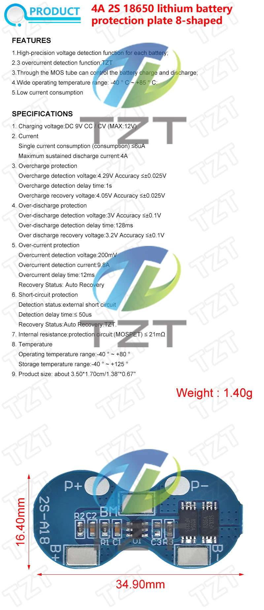

# TZT 2S Li‑ion Charger / Protection Board (≈4 A)

**Short description**
2S protection board with balancing for dual 18650 packs. Provides overcharge, overdischarge and overcurrent protection and balance support.

**Typical specs (verify on your board)**
- Configuration: 2S (7.4 V nominal)
- Rated working current: ≈4 A (check board marking)
- Protections: overcharge, overdischarge, overcurrent, short-circuit

**Wiring**
See `wiring.md` in this folder for the 2S wiring example and safety notes.

**Files**
- Images: present in the folder (embed added to main index)
- README: this file

**Notes & Safety**
- Confirm ratings and IC markings for exact thresholds.
- Use correct fusing and test with a low-current load before full use.

*Send pictures of the board silkscreen or IC markings and I will add more precise threshold values.*