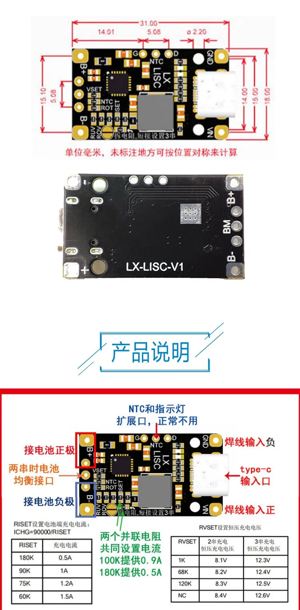

# Type‑C USB 2/3S BMS (IP2326) — Charging / Boost / BMS

**Short description**
Multi‑cell BMS board supporting 2S/3S packs with Type‑C input, balance support, charging and boost functions. The board in this folder includes an IP2326 datasheet and a pinout image.

**Key notes**
- There is a schematic file in this folder but the original README notes it may be incorrect — prefer the IP2326 datasheet and verify pins with a meter.

**Typical specs (verify on your board)**
- Supported packs: 2S / 3S
- Typical power: up to 15 W and ~1.5 A on the configured outputs (verify variants)
- Balance and charge control implemented by an IC (see `IP2326 datasheet v1.0.pdf`)

**Wiring**
See `wiring.md` in this folder for 2S wiring and Type‑C input notes. Confirm Type‑C CC wiring if the board uses a true Type‑C receptacle for negotiated current.

**Files**
- `IP2326 datasheet v1.0.pdf` — use as primary reference for IC pinout
- `lisc-pinout.png` — pinout image
- Images: several product images in this folder

**Notes & Safety**
- Verify the Type‑C implementation (VBUS and CC lines) before connecting to power sources for safety.
- Do not rely on the provided schematic image if the README notes it is wrong — instead use the datasheet and measure continuity before powering.

*If you want, I can extract a concise pinout and expected thresholds from the IP2326 datasheet and add it here.*