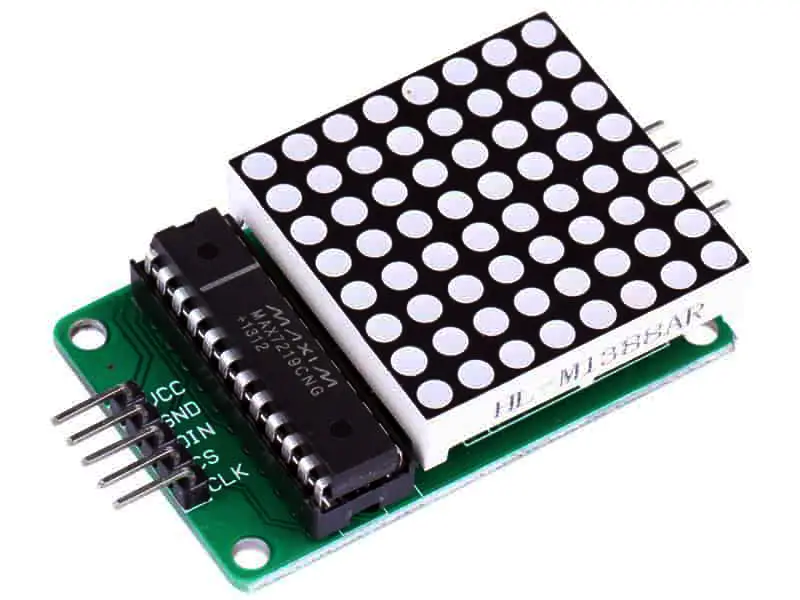

# MAX7219 Dot Matrix Module

**Short description**
LED matrix module driven by the MAX7219/MAX7221 serial LED driver. Commonly used for 8×8 or cascaded displays for text and simple graphics.

**Key specs / pins**
- VCC: 5 V (some modules can be powered from 3.3 V; verify)
- GND: ground
- DIN (MOSI) : data input
- CLK (SCK) : clock
- CS (LOAD) : chip select / load

**Wiring**
See `wiring.md` for SPI connections and chaining multiple modules in series.

**Files**
- `MAX7219-Based-LED-Dot-Matrix-Display-Module-Pinout.jpg` (pinout image)
- `MAX7219-MAX7221.pdf` (datasheet)

**Notes & Safety**
- Use current-limiting resistors where appropriate or rely on module's built-in resistors.
- For long chains, connect GND between controllers and ensure robust power supply for LEDs.

*Add pictures of your wiring or the module board silkscreen to improve this documentation.*