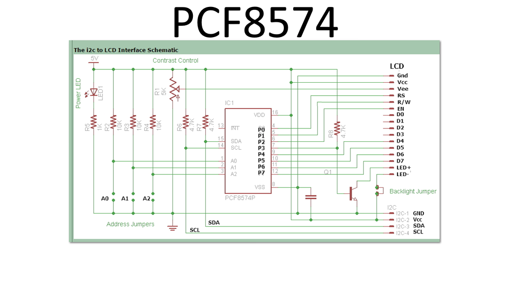

# PCF8574 I2C GPIO Expander

**Short description**
PCF8574 is an I2C 8-bit port expander used to add GPIO pins over the I2C bus. Commonly used for driving 7-segment displays, key matrices, or additional IO for microcontrollers.

**Key notes**
- Interface: I2C (address configurable via A0–A2 pins)
- 8 quasi-bidirectional I/O pins

**Wiring**
See `wiring.md` for typical I2C wiring and example usage.

**Files**
- `pcf8574.pdf` (datasheet)
- `image-2.png` (module image)

*Add example code or measured I2C address if available.*