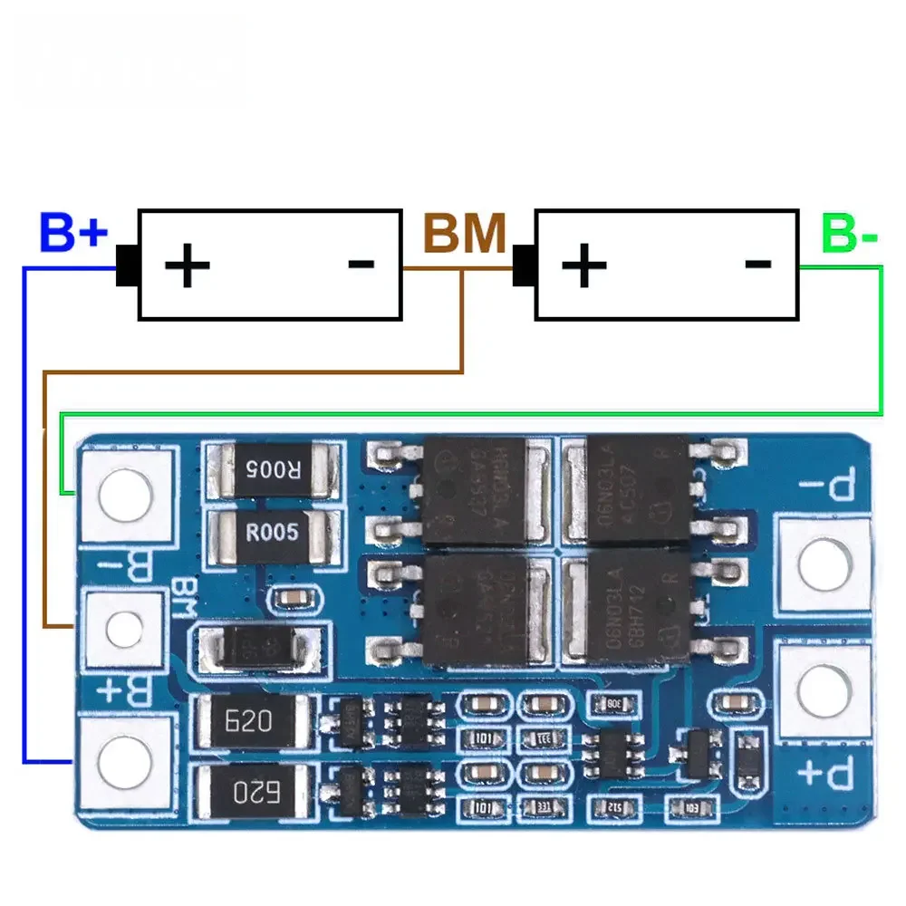

# 2S BMS Protection Board (HX-2S-JH20 style)

**Short description**
2-cell Li-ion battery protection board with balancing and charge/discharge control intended for dual 18650 packs.

**Key specs (from board label — verify with meter / seller listing)**
- Model: HX-2S-JH20 (typical)
- Charging voltage per cell: ~4.25–4.35 V (±0.05 V)
- Pack charging voltage: ~8.4–9 V
- Typical working current: ~10 A
- Maximum instantaneous current: ~20 A
- Static current: < 10 μA
- Size: 46.7 × 23 × 3.15 mm

**Pinout / Terminal descriptions**
- B+ : pack positive (cell2 +)
- B- : pack negative (cell1 -)
- MMB / B1 : middle balance point between cell1 and cell2
- P+ / P- : pack charge/discharge output terminals

**Wiring**
See `wiring.md` in this folder for a short wiring diagram and example. Connect cells in series and ensure B1 / MMB is connected between the two cells.

**Files**
- Image: `S7cd60b97ad3a4c7baa2ed66f75ca0722m.webp`
- README: this file (add measured parameters or seller link if available)

**Notes & Safety**
- Confirm the current rating before using with high-current loads.
- Balance and protection thresholds can vary by controller IC. If you can read the IC marking, share it for more precise thresholds.

*Report any specific IC markings or measured thresholds and I will extend this spec section.* 