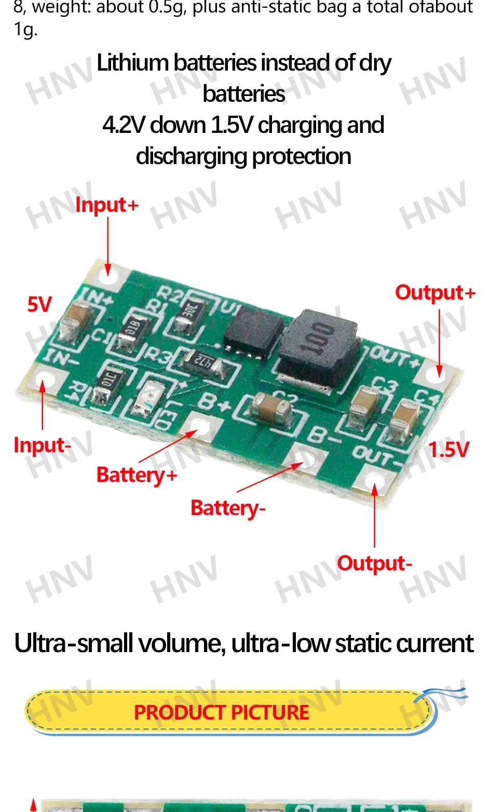

# AA / AAA Li‑ion Adapter (3.7–4.2 V → ~1.5 V)

**Short description**
Adapter that steps a single Li‑ion cell down to ~1.5 V to mimic AA/AAA disposable batteries. Good for low‑power legacy devices that require ~1.5 V.

**Typical behavior**
- Expect a no‑load voltage around 1.5 V; regulation under varying loads may change depending on the adapter design.

**Wiring**
See `wiring.md` in this folder for connection and quick checks (measure no‑load and under light load).

**Files**
- Image: `Se2403a4270644fe3a738096ad8ea9fbcl.webp`
- README: this file

**Notes & Safety**
- Do NOT attempt to charge the Li‑ion cell through a device unless the adapter explicitly supports charging.
- Verify polarity and measure the adapter output before insertion into devices.

*Add photos or measured voltage under load to improve this documentation.*