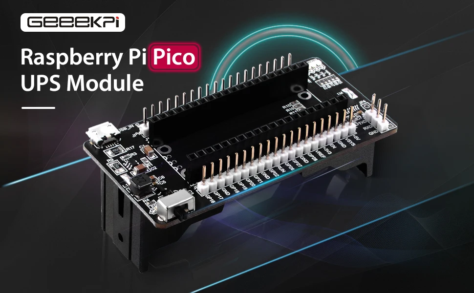

# GeeekPi Raspberry Pi Pico UPS (1×18650)

**Short description**
Plug‑and‑play UPS module for Raspberry Pi Pico / Pico W / W2 that accepts a single 18650 cell and supplies the Pico with regulated power. Useful for portable projects and field testing.

**Key specs (verify on your board)**
- Battery: single 18650 cell
- Output: board feeds Pico VSYS / 5V pin (confirm by board silkscreen)
- Typical features: auto power-switching between USB and battery, onboard charging (varies by version)

**Wiring**
See `wiring.md` in this folder for connections and notes on USB vs battery behaviour.

**Files**
- Images: `S6a45ee01fc5e4d11aedc195ac19e968dV.webp`, `Se83d645d14be4adf8f7bcdad2e1e0da0Y.webp`

**Notes & Safety**
- Confirm how the module handles USB power and charging to avoid back-feeding or unexpected charging behaviour.
- If auto-switching behavior is unknown, measure outputs with and without USB connected before mounting the Pico.

*Add photos of the silk labels and measured voltages for exact verification.*