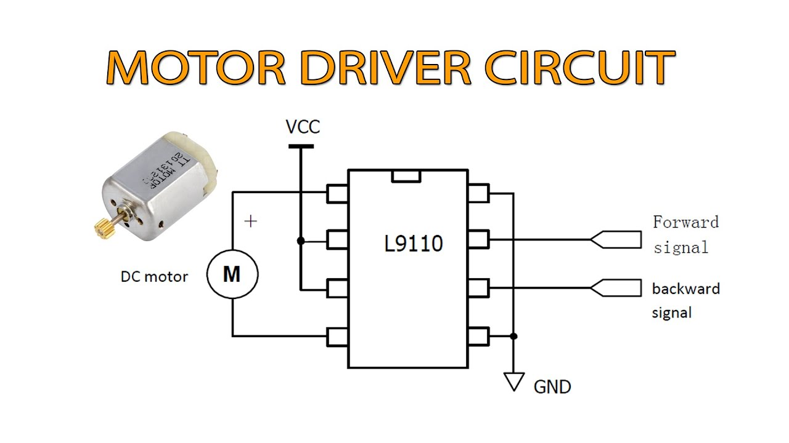

# L9110 Motor Driver Module

**Short description**
L9110 dual-channel motor driver module is a small H-bridge driver for DC motors or small stepper motors. It is commonly used in toy cars and simple robotics projects.

**Key notes**
- Supply voltage: typically 2.5–12 V (check module)
- Control pins: two inputs per motor (IN1/IN2 for motor A, IN3/IN4 for motor B)

**Wiring**
See `wiring.md` for motor and control wiring examples.

**Files**
- `l9110c.jpg` (module image)

*Verify motor current and heat dissipation; use external driver for higher-current motors.*