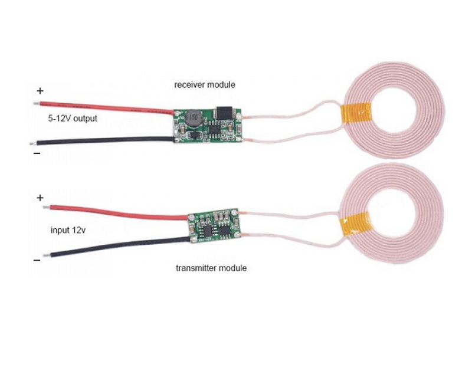

# XKT‑412 Wireless Power Transmitter/Receiver Module

**Short description**
Wireless power transmitter / receiver kit (coil-based) for 5 V / 2 A wireless charging applications. Useful for prototyping Qi-like wireless power projects.

**Key notes**
- Typical input: 5 V for transmitter and receiver electronics
- Output: ~5 V regulated for receiver (depending on module)
- Important: alignment of coils affects power transfer

**Wiring**
See `wiring.md` in this folder for connection example and safety notes.

**Files**
- `XKT-412-5V-2A-...jpg` (product image)

*Use low-ESR capacitors and verify temperature during initial tests.*