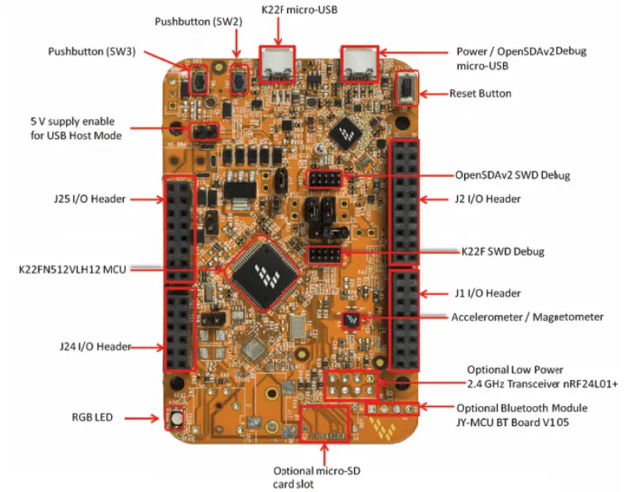

# NXP

This directory contains NXP microcontroller development boards and resources.

## Contents

### FRDM-K22F
FRDM-K22F Freedom development board based on NXP K22F microcontroller (ARM Cortex-M4). Contains:
- Board schematics
- User guides
- Datasheets
- Example projects
 

### FRDM-KL27Z
FRDM-KL27Z Freedom development board based on NXP KL27Z microcontroller (ARM Cortex-M0+). Contains:
- Board schematics
- User guides

