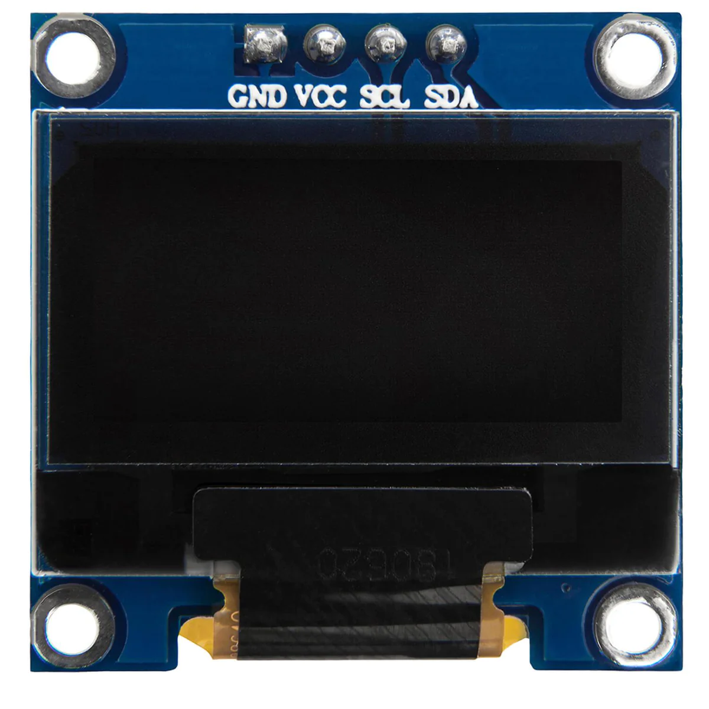
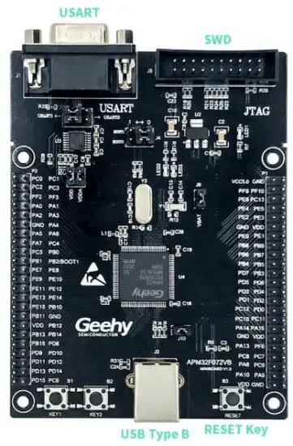
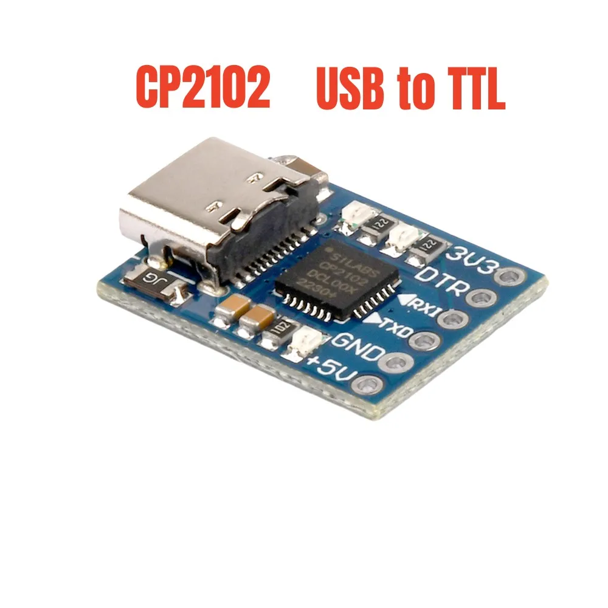
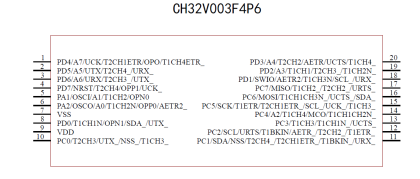
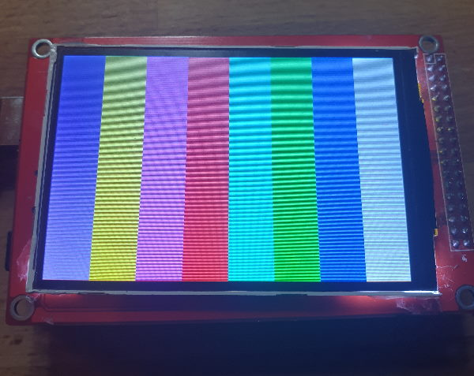

# HardwareModules
List of all my arduinos, ESPs, STM32s modules

## Directories

### [Arduino](/Arduino)
Various Arduino boards and development kits including Nano, Pro Mini, Leonardo, ATTINY85, and custom development boards.
 

### [AVR](/AVR)
AVR microcontroller development boards and tools including Butterfly and STK500 programmer.

### [CH582F](/CH582F)
CH582F microcontroller development resources.

### [COMPONENTS](/COMPONENTS)
Hardware components including displays (SSD1306), sensors (WS2812, WS2812B, YF923), and linear sensors.
 

### [Cypress](/Cypress)
Cypress microcontroller development boards including CY8CKIT-059.
 

### [Displays](/Displays)
Display modules and libraries including:
* 1.7" SPI 128x160 OLED ST7735
* TM1637 Digital Tube LED Clock Display
* UTFT for Arduino Mega (PlatformIO)
* HD44780 LCD displays
* Nokia LCD5110 (PCD8544)
* SSD1306 OLED displays
* ST7789 TFT displays
* GM12864 GLCD modules
 

### [EINK](/EINK)
E-ink display modules including Lilygo T5-4.7 inch displays.
 

### [ESP](/ESP)
ESP32 and ESP8266 development boards including:
* Heltec WiFi Kit 8
* ESP32TTGO-OLED-18650
* TS V1.0 Esp32 1.44 TFT Display
* Wemos with Display
* ESP-01, ESP-03, ESP32-CAM
* T-Display-S3
* Various TTGO boards
 

### [Geehy](/Geehy)
Geehy APM32 microcontroller development boards and SDKs.
 

### [GigaDevice](/GigaDevice)
GigaDevice GD32 microcontroller boards including GD32VF103 (RISC-V) and GD32E232K.
 

### [IC](/IC)
Integrated circuit datasheets and documentation.

### [Modules](/Modules)
Various electronic modules including:
* Battery management modules
* CC1101 RF modules
* CP2102 USB-to-UART converters
* DS3231 RTC modules
* NRF24L01 wireless modules
* VS1053B MP3 player modules
* Motor drivers (A3967, l9110)
* Display modules (MAX7219, 8x8 RGB boards)
* And many more...
 

### [NORDIC](/NORDIC)
Nordic Semiconductor development boards including nRF52810, nRF52833, and Embeetle boards.

### [NXP](/NXP)
NXP microcontroller development boards including FRDM-K22F and FRDM-KL27Z.
 

### [PROJECTS](/PROJECTS)
Complete hardware projects including LoRaWAN LR1262 designs with KiCad schematics and PCB files.

### [Raspberry](/Raspberry)
Raspberry Pi RP2040-based boards including RP2040-Matrix and RP2040-Tiny.
 

### [SHIELDS](/SHIELDS)
Arduino shields including:
* Multi Function Shield
* OPEN-SMART Rich Shield TWO
* VS153 MP3 Shield
* ZYA0031 IoT Training Kit
* Joystick shields
 

### [STM32](/STM32)
STM32 microcontroller development boards including:
* BluePill, BlackPill
* NUCLEO series (F303K8, C031C6, L152RE, H563ZI)
* Discovery boards (F3DISCOVERY, F429-Discovery, F746G-Discovery)
* Mini development boards
* STM32F407VET6, STM32F103C8T6 variants
* WeAct Black Pill V3.0
* STLink programmer/debugger
 

### [STM8](/STM8)
STM8 microcontroller development boards and documentation including STM8S103F3 development board.
 

### [WCH](/WCH)
WCH microcontroller boards including CH32V003 series (RISC-V) development kits and examples.
 

---

## Featured Boards

### Displays
* [1,7 SPI 128x160 OLED ST7735  
](/Displays/1,7_SPI_128x160_OLED_ST7735)

* <a href="/Displays/TM1637"> 4 Bits TM1637 Digital Tube LED Clock Display Module For Arduino Due UNO 2560 R3   </a>

* <a href="/Displays/UTFT"> UTFT for arduino mega (Paltformio)  
</a>

### ESP
* <a href="ESP/HELTEC"> Heltec WiFi Kit 8   
</a>
* <a href="ESP/ESP32TTGO-OLED-18650">ESP32TTGO-OLED-18650  
</a>

* <a href="ESP/TTGO">TS V1.0 Esp32 1.44 TFT Display MicroSD Card Slot Speakers WIFI Bluetooth Module  </a>

* <a href="ESP/Wemos-32-With-OLED">Wemos with Display </a>

### STM32
* <a href="/STM32">STM32</a>

### STLink
* <a href="/STM32/STLink">STLink v2 </a>

### STM8 
* <a href="/STM8">STM8s103F3 Development board 
 </a>

### Arduino
* <a href="/Arduino/Digistump-ATTINY85">Digistump ATTINY85 </a>

### GD32
* <a href="GigaDevice/GD32VF103">GD32VF103 </a>

### Cypress
* <a href="/Cypress/CY8CKIT-059">CY8CKIT-059 </a>

### Shields (arduino)
* <a href="SHIELDS/Multi_Function_Shield">Multi function Shield </a>

### Battery Charger
* Battery charger modules can be found in [Modules/battery modules](/Modules/battery%20modules/)

### Modules
* <a href="/Modules/CP2102">CP2102 Micro USB to UART TTL Module 6Pin Serial Converter STC Replace FT232 </a>
