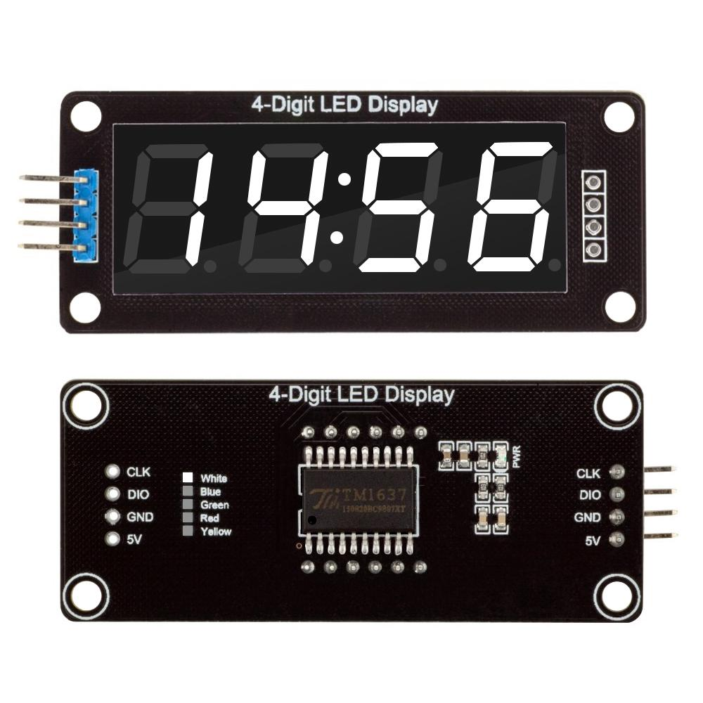

# HardwareModules
List of all my arduinos, ESPs, STM32s modules

# Displays
* [1,7 SPI 128x160 OLED ST7735  
](/Displays/1,7_SPI_128x160_OLED_ST7735)

* <a href="/Displays/TM1637"> 4 Bits TM1637 Digital Tube LED Clock Display Module For Arduino Due UNO 2560 R3   </a>

* <a href="/Displays/UTFT"> UTFT for arduino mege (Paltformio)  
</a>

# ESP
* <a href="ESP/HELTEC"> Heltec WiFi Kit 8   
</a>
* <a href="ESP/ESP32TTGO-OLED-18650">ESP32TTGO-OLED-18650  
</a>

* <a href="ESP/TTGO">TS V1.0 Esp32 1.44 TFT Display MicroSD Card Slot Speakers WIFI Bluetooth Module  </a>

* <a href="ESP/TTGO">Wemos with Display </a>

# STM32
* <a href="/STM32">STM32</a>

# STLink
* <a href="/STM32/STLink">STLink v2 </a>

# STM8 
* <a href="/STM8">STM8s103F3 Development board 
 </a>
# Arduino
* <a href="/Arduino/Digistump-ATTINY85">Digistump ATTINY85 </a>

# GD32
* <a href="GigaDevice/GD32VF103">GD32VF103 </a>

# Cypress
* <a href="/cypress/CY8CKIT-059">CY8CKIT-059 </a>

# Shields (arduino)
* <a href="SHIELDS/Multi_Function_Shield">Multi function Shield </a>

# Battery Charger
* <a href="/Battery_Charger/DD28CRTA">3.7V 3.8V 7.4V 11.1V 12V 14.8V 18.5V Lithium li-on Lipo 18650 Battery Charger </a>

# Modules
* <a href="/CP2102USB2UART">CP2102 Micro USB to UART TTL Module 6Pin Serial Converter STC Replace FT232 </a>