# Hardware Repository Documentation Summary

This repository contains documentation for various hardware components, microcontrollers, and projects. All major folders have been standardized with `README.md` and `wiring.md` files.

## Summary of Updates
- **Standardized Folders**: All top-level directories now include a `README.md` and a `wiring.md` (or link to a central one).
- **Wiring Guides**: Detailed `wiring.md` files provide power, programming, and pinout information.
- **Improved Navigation**: All READMEs link to their respective wiring guides.
- **Image Integration**: Images and diagrams have been linked where available.

## Repository Structure

```mermaid
graph TD
    Root[Hardware] --> MCU[Microcontrollers]
    Root --> PER[Peripherals]
    Root --> PRJ[Projects & Kits]
    
    MCU --> STM32[STM32 Series]
    MCU --> ESP[ESP32 / ESP8266]
    MCU --> AVR[AVR / Arduino]
    MCU --> WCH[WCH RISC-V]
    MCU --> STM8[STM8 Series]
    MCU --> Geehy[Geehy APM32]
    MCU --> Giga[GigaDevice]
    MCU --> NXP[NXP / Kinetis]
    MCU --> NORDIC[Nordic nRF]
    MCU --> Cyp[Cypress PSoC]
    MCU --> CH582[CH582F]
    
    PER --> DISP[Displays & E-Ink]
    PER --> MOD[Breakout Modules]
    PER --> IC[Integrated Circuits]
    PER --> COM[Components]
    
    PRJ --> PROJ[Specific Projects]
    PRJ --> SHLD[Arduino Shields]
    PRJ --> SOLD[Soldering Kits]
    PRJ --> RPI[Raspberry Pi / RP2040]
    PRJ --> POW[Power Supplies]

    subgraph "Documentation Standard"
        R[README.md] --- W[wiring.md]
    end
```

## Folder Status Table

| Folder | Documentation Status | Key Features |
| --- | --- | --- |
| **STM32** | ✅ Complete | Extensive subfolder coverage (F1, F3, F4, F7, H7, G4, L1, WB) |
| **ESP** | ✅ Complete | ESP32, ESP8266, S3, C3, C6 variants |
| **WCH** | ✅ Complete | CH32V003 series and core wiring notes |
| **STM8** | ✅ Complete | STM8S103F3 and general notes |
| **Geehy** | ✅ Complete | APM32F072VB and STM32 compatibility notes |
| **NORDIC** | ✅ Complete | nRF52 series notes |
| **NXP** | ✅ Complete | Kinetis FRDM boards |
| **Cypress** | ✅ Complete | PSoC 5LP prototyping |
| **Modules** | ✅ Complete | 20+ breakout modules with wiring |
| **Displays** | ✅ Complete | OLED, TFT, LCD, and Character displays |
| **EINK** | ✅ Complete | Lilygo T5 and general e-paper notes |
| **Shields** | ✅ Complete | Educational and IoT shields |
| ... | ... | ... |

---
*Last updated: January 2026*