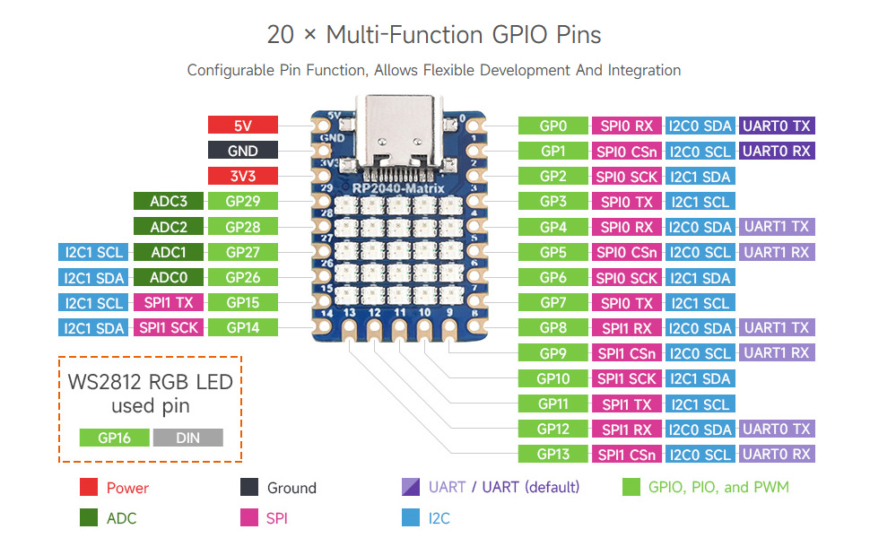

# Raspberry

This directory contains Raspberry Pi RP2040-based development boards and projects.

## Contents

### RP2040-Matrix
RP2040 Matrix development board - a board designed for matrix/LED applications. Contains:
- Getting started documentation
- C SDK documentation
- Board schematic
- Example projects for RP2040-Zero
 

### RP2040-Tiny
RP2040 Tiny development board - a compact RP2040-based board. Contains:
- Board schematic
- RP2040-Zero example projects (C and Python)
- UF2 bootloader files

Both boards are based on the Raspberry Pi RP2040 microcontroller featuring dual-core Cortex-M0+ processors with programmable I/O (PIO).

