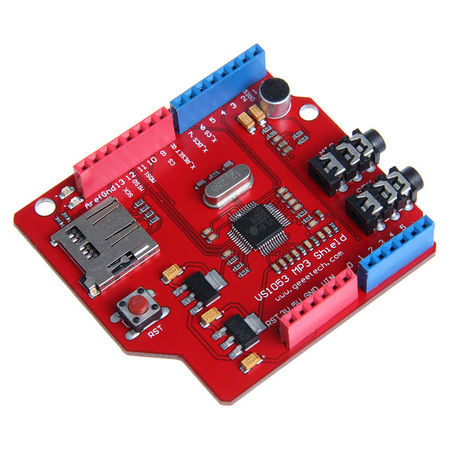

# SHIELDS

This directory contains Arduino shields - expansion boards that plug into Arduino-compatible boards.

## Contents

### Joystick
Joystick shield documentation and schematics.

### Multi_Function_Shield
Multi-function shield for Arduino - a popular educational shield featuring:
 
- LEDs
- 7-segment displays
- Potentiometer
- Buzzer
- Buttons

### OPEN-SMART Rich Shield TWO
Comprehensive Arduino shield with multiple features:
 
- Battery charging circuit
- NeoPixel RGB LEDs
- 16x8 LED matrix display
- Rotary encoder
- Joystick
- Temperature sensor (DS18B20)
- Sound sensor
- Human motion sensor
- Includes complete Arduino libraries and examples

### VS153 MP3
VS153 MP3 shield for playing MP3 audio from SD card.

### VS153-MP3
VS153 MP3 shield with VS1053B decoder chip. Includes:
 
- MP3 player library examples
- Schematic diagrams
- Arduino code examples

### ZYA0031
ZYA0031 IoT Training Kit shield - a comprehensive learning shield with:
- RGB LEDs
- LCD1602 display
- DHT11 temperature/humidity sensor
- DS1307 RTC
- HC-SR04 ultrasonic sensor
- NRF24L01 wireless module
- Active buzzer
- ESP8266 NodeMCU code examples
- Complete documentation in English

