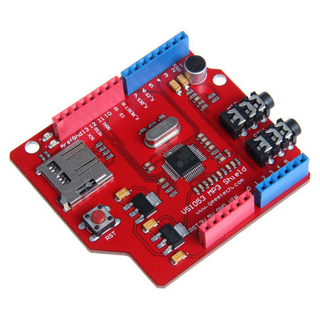
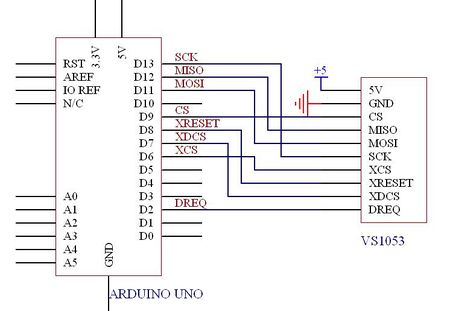
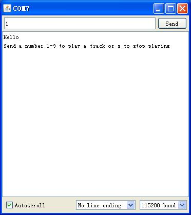

# Source
https://www.geeetech.com/wiki/index.php/Arduino_MP3_shield_board_with_TF_card

# Introduction


This `MP3` shield board is designed based on `VS1053B` from VLSI. using this shiled you can plug in your arduino `UNO/MEGA` direcly as showing in pic, dont' need need to hook up with jumpers, it's becomes more easy to play music compared with the tiny mp3 breakout board. `VS1053` is a versatile `MP3` codec processor that is capable of decoding a variety of music formats,including `Ogg Vorbis/MP3/AAC/WMA/MIDI audio`. For the best headphone listening experience, the `VS1053` includes EarSpeaker spatial processing which accurately simulates how a room with stereo loudspeakers would sound. In addition to being able to decode all major formats, `VS1053` is capable of recording in `Ogg Vobis` file.

With the `TF card` slot on the other side of the board, you can play `mp3` files from `TF card` using this breakout. It is easily to drop it in your project or make a `mp3` player using your `Arduino` or other microcontroller. Features Can play a variety of music formats, support for `OGG` encoding real-time recording `SPI` interface, the control signal lines are led out A headphone and stereo output A microphone for recording A `line_in` input interface Power indicator `3.3V` and `2.8V` of `LDO` chip `AMS-1117` on board, provides up to `800mA` current A single power supply: `+5 VDC 12.288 Mhz` crystal `TF` cart slot. 

## Features
* Can play a variety of music formats, support for `OGG` encoding real-time recording
* `SPI` interface, the control signal lines are led out
* A headphone and stereo output
* A microphone for recording
* A `line_in` input interface
* Power indicator
* `3.3V` and `2.8V` of LDO chip `AMS-1117` on board, provides up to `800mA` current
* A single power supply: `+5 VDC`
* `12.288 Mhz` crystal
* `TF card` slot

### Decodes  formats
* `Ogg Vorbis` 
* `MP3` = MPEG 1 & 2 audio layer III (CBR+VBR+ABR) 
* `MP1` & `MP2` = MPEG 1 & 2 audio layers I & II optional 
* `MPEG4` / 2 AAC-LC(+PNS), HE-AAC v2 (Level 3) (SBR + PS) 
* `WMA4.0/4.1/7/8/9` all profiles (5-384 kbps) 
* `FLAC` lossless audio with software plugin (upto 24 bits, 48 kHz) 
* `WAV` (PCM + IMA ADPCM) 
* General `MIDI 1` / `SP-MIDI` format 0
### Encodes formats from mic/line
* `Ogg Vorbis` with software plugin 
* `IMA ADPCM` 
* `16-bit PCM`

## Document

[VS1053 datasheet](vs1053s.pdf)
## Usage

Here is guide illustrate you how to connect `VS1053` breakout to Arduino Uno and play mp3 stored in your `TF card`.





After connecting your Arduino to the `VS1053` breakout board, insert the TF card which stores your `mp3` files with the filename like `track001.mp3`, `track002.mp3` and etc into the TF card slot.<br>

Download the [[File:MP3-TF.zip]] and put them in the folder `/Arduino/libraries`, then open the Arduino IDE 1.0 and upload the examples MP3Shield-Library-Demo. 



Open the serial monitor with the baudrate `11520`, input the number `x` will play the corresponding mp3 file `track00x.mp3` in your TF card.


## SDCard Pin
```c
const uint8_t SdChipSelect = 9;
```