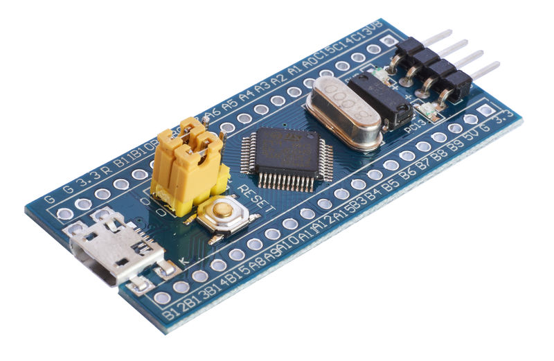

https://satoshinm.github.io/blog/171212_stm32_blue_pill_arm_development_board_first_look_bare_metal_programming.html
https://wiki.stm32duino.com/index.php?title=Blue_Pill

# Description
* Model: STM32F103C8T6.
* Core: ARM 32 Cortex-M3 CPU.
* Debug mode: SWD.
* 72MHz work frequency.
* 64K flash memory, 20K SRAM.
* 2.0-3.6V power, I/O.
* Reset(POR/PDR).
* 4-16MHz crystal.
* On-board Mini USB interface, you can give the board power supply and USB communication.
* Size:5.3cm x 2.2cm.

# Image

# Links
[https://wiki.stm32duino.com/index.php?title=Blue_Pill](https://wiki.stm32duino.com/index.php?title=Blue_Pill)

# Pinout

# Neopixel
https://www.thevfdcollective.com/blog/stm32-and-sk6812-rgbw-led
