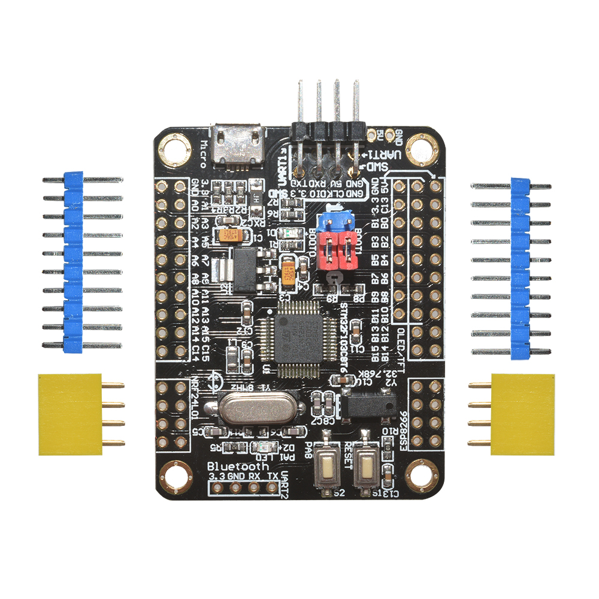

# Description
STM32F103C8T6 ARM Minisystem Development Board STM32 Development Core Board

    MCU: STM32F103C8T6 ARM Cortex M3 72 MHz
    RAM: 20 KB
    Internal Flash: 64 KB (possibly 128 KB)
    External Flash: Winbond W25X16 (16 Mbit, SPI interface)
    EEPROM: Atmel 24C04N (4 kbit, I2C interface)
    Real-Time Clock: High Speed External (HSE) crystal oscillator at 8 MHz, Low Speed External (LSE) crystal oscillator at 32.768 kHz
    Jumpers: Boot0 and Boot1
    Debugger Interface: ST-Link (SWD)
    USB Interface: Micro USB connector (power and data)
    Reset Button
    User Button: PA8
    LED: PA1
    TF Card Interface (SPI)
    WiFi Interface: Espressif ESP8266 (UART)
    RF Interface: Nordic Semiconductor nRF24L01 (SPI)
    Ethernet Interface: WizNET W5500
    Audio Interface: VLSI Solution VS1053

# Image

# Programming
When connected to computer new device appears `Maple DFU`

# install
https://github.com/rogerclarkmelbourne/Arduino_STM32/wiki/Installation

# More info
    https://stm32-base.org/boards/STM32F103C8T6-Black-Board

    https://item.taobao.com/item.htm?spm=a312a.7700824.w4004-25037159111.13.2a9e7b32OinQKy&id=533835156907

    https://drive.google.com/drive/folders/1ILp-uZoT5DasWUy2G_Jp88a2F-UB3hnd

# Display connection

PB1 N.C.
PB3 SCL
PB5 SDA
PB7 RES
PB9 DC
PB11 BLK