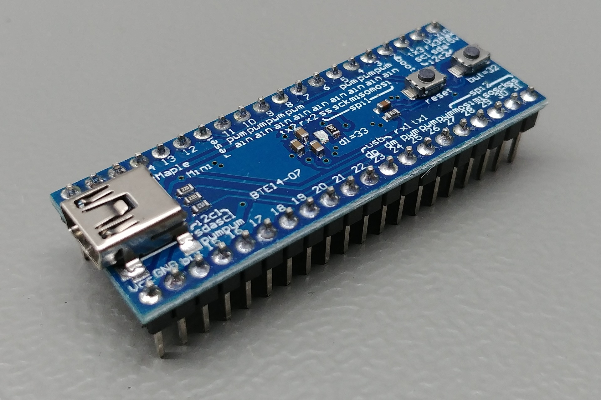
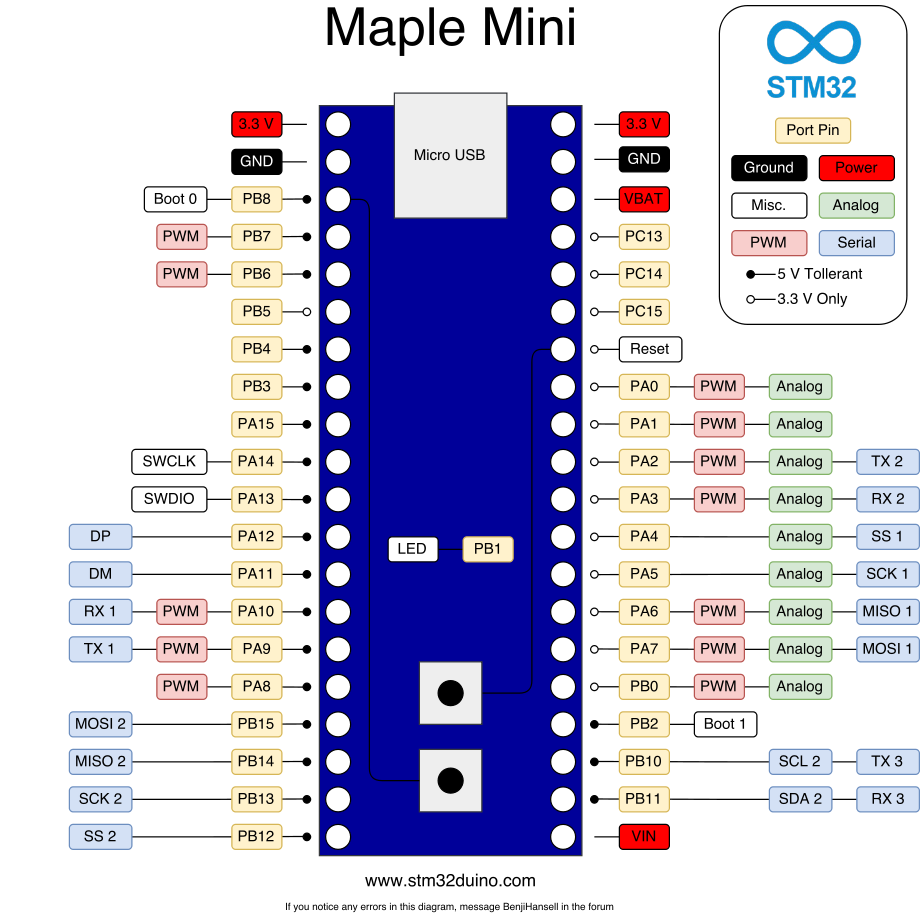
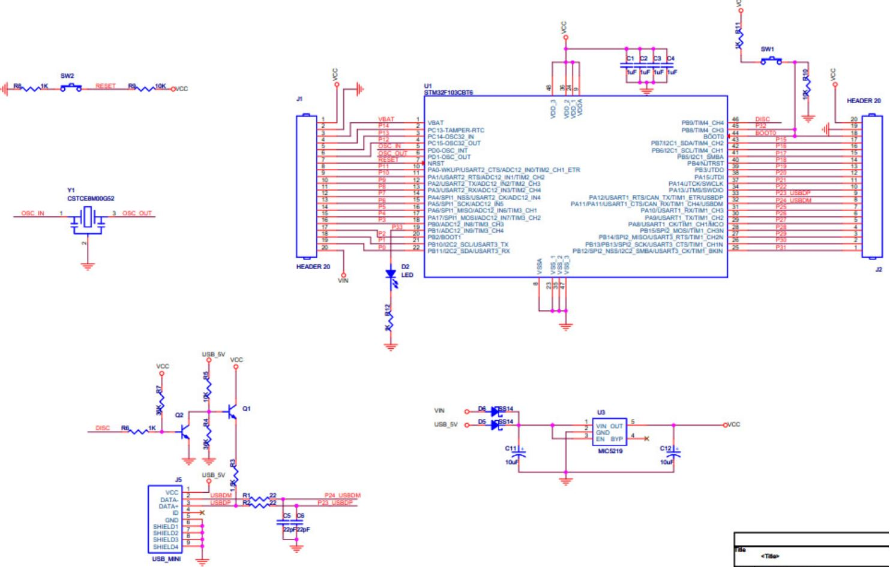
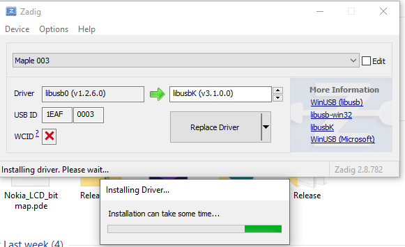

# Maple mini (clone)

See [wiring.md](wiring.md) for wiring and programming details.

# Board
* Name	Maple Mini Clone
* Part	BTE14-07
* Brand	Unknown
* Origin	China
# Microcontroller
* Part	*STM32F103C8T6*
* Manufacturer	_ST-Microelectronics_
* Core	Arm Cortex-M3
* Max. Clock Speed	72MHz
* Package	LQFP 48 pins

## Pinout


## Schematic


## Links
[stm32-base description](https://stm32-base.org/boards/STM32F103C8T6-Maple-Mini-Clone.html)

[stm32duinoforum.com](https://stm32duinoforum.com/forum/wiki_subdomain/index_title_Maple_Mini.html)

https://www.instructables.com/Small-But-Powerful-STM32/


http://www.count-zero.ru/2015/leafmaple/


## Problems

```
No DFU capable USB device available
```

