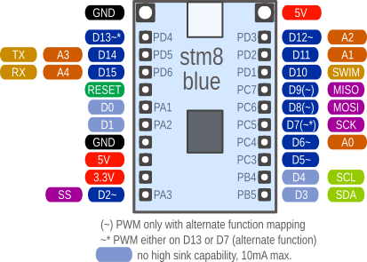
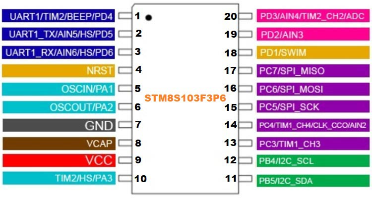
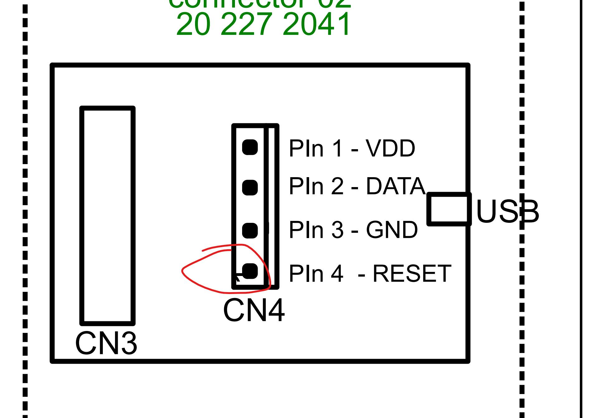
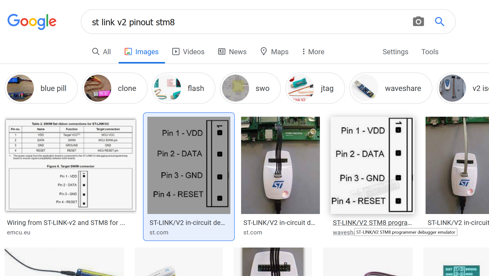

# ST STM8S103F3 Breakout Board 


| Parameter | Value  |
| ------------- |-------------|
| CPU | MCUSTM8S103F3P6|
| Frequency | 16 MHz |
| Flash| 8 KB |
| RAM | 1 KB |

## Pinout




## Documentation
* [AN3252 Building a wave generator.pdf](AN3252-Building-a-wave-generator.pdf)
* [an2752 getting started with stm8s and stm8af microcontrollers stmicroelectronics.pdf](an2752-getting-started-with-stm8s-and-stm8af-microcontrollers--stmicroelectronics.pdf)
* [Atmel AVR4027 Tips and Tricks to Optimize Your C Code for 8-bit AVR Microcontrollers.pdf](Atmel%20AVR4027%20Tips%20and%20Tricks%20to%20Optimize%20Your%20C%20Code%20for%208-bit%20AVR%20Microcontrollers.pdf)
* [cd00190271 stm8s series and stm8af series 8bit microcontrollers stmicroelectronics.pdf](cd00190271-stm8s-series-and-stm8af-series-8-bit-microcontrollers-stmicroelectronics.pdf)
* [Microstepping motor drive with STM8A and STM8S microcontrollers.pdf](Audio%20software%20codec%20for%20STM8/Microstepping%20motor%20drive%20with%20STM8A%20and%20STM8S%20microcontrollers.pdf)
* [stm8s103f2 Datasheet.pdf](stm8s103f2%20Datasheet.pdf)
## Links

* PlatformIO projects, Uploading via STMLinkV2
https://docs.platformio.org/en/stable/boards/ststm8/stm8sblue.html

* Bare Metal stm8 https://lujji.github.io/blog/bare-metal-programming-stm8/
https://github.com/lujji/stm8-bare-min

## Projects

* `IAR_Tamplate_BEEP` - BEEP Example, used hardware BEEP functionality
	```
	Hardware beep on PIN1
	```

* `spl-uart-simple-printf` - PrintF to UART

* `STM8-helloWorld` - blink on PB5

* `TWI1602` -  LCD With I2C module, Beeps
	```
	`PD4` - beeper
	`LCD`:
		PB4 - SCL
		PB5 - SDA
	```		
			
### More links
* [STM8S/A Standard peripheral library](https://www.st.com/content/st_com/en/products/embedded-software/mcu-mpu-embedded-software/stm8-embedded-software/stsw-stm8069.html)

* [Getting started with STM8 Development Tools on GNU/LINUX](https://github.com/hbendalibraham/stm8_started)

## JTAG





## When connecting original ST-Link 

* power must come from USB connector