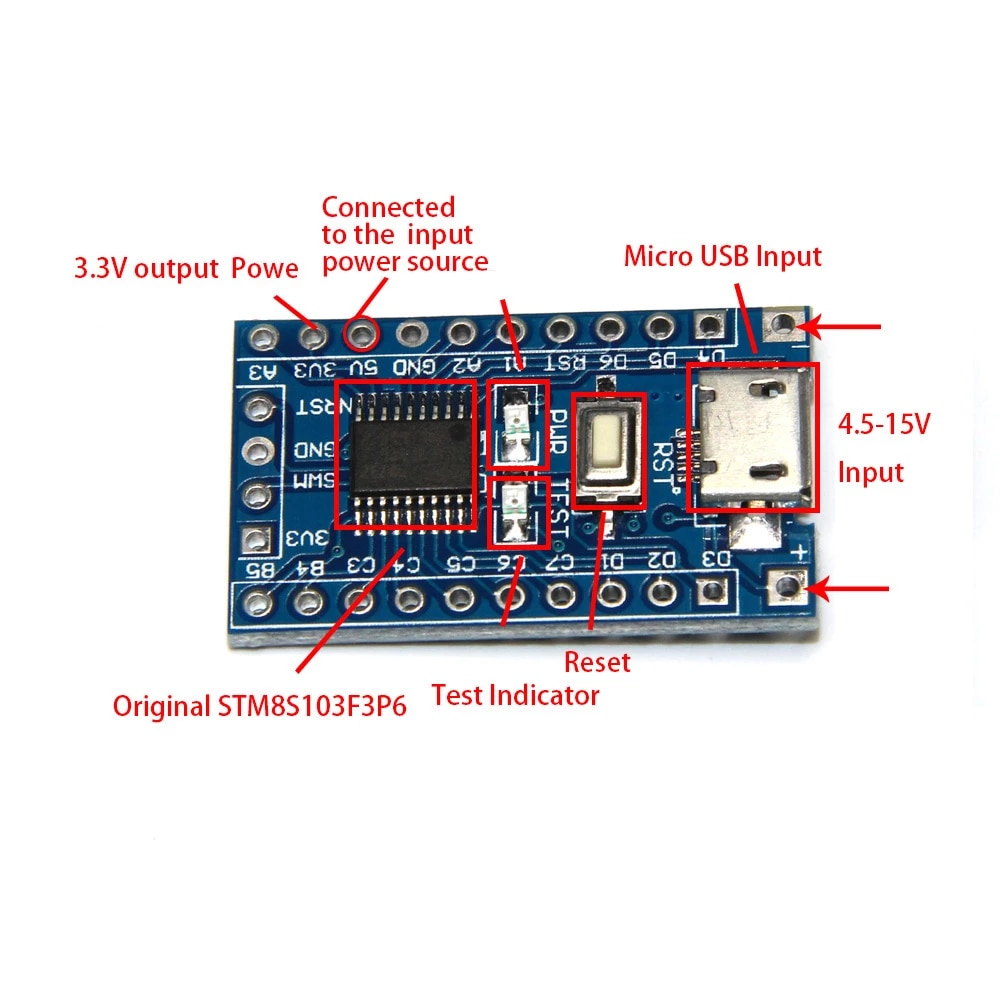

# STM8

This directory contains STM8 microcontroller development boards and documentation.

## Contents

### STM8S103F3
STM8S103F3 development board - ARM STM8 development board with minimum system board.

## IDE

* IAR Embedded Workbench IDE
	- set target: STM8S103F3P
	- emulator or ST-Link

 