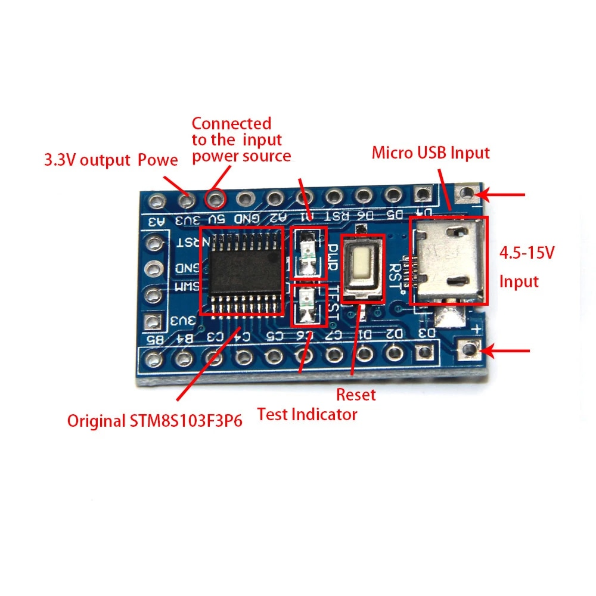

# STM8

This directory contains STM8 microcontroller development boards and documentation.

See [wiring.md](wiring.md) for general STM8 wiring and programming notes.

## Contents

### STM8S103F3
STM8S103F3 development board - ARM STM8 development board with minimum system board.

 

## IDE Support

* **IAR Embedded Workbench IDE**
	- Set target: STM8S103F3P
	- Use emulator or ST-Link

* **STM8S_StdPeriph_Lib**
	- Standard Peripheral Library with examples
	- Includes ADC, UART, SPI, I2C, Timer, and GPIO examples

* **PlatformIO**
	- PlatformIO project examples available

* **EIDE**
	- EIDE project templates and examples

## Documentation

- Application notes on STM8 programming and peripherals
- Datasheets and reference manuals
- Standard Peripheral Library documentation
- Example projects for various peripherals
