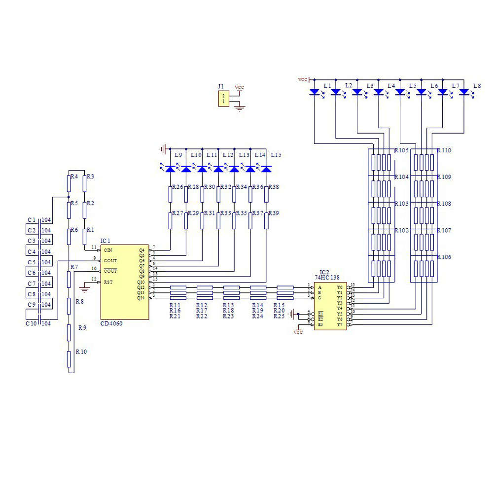

# Soldering KIT

This directory contains DIY soldering practice kits and related resources.

## Contents

### DIY Kit RGB LED Flashing Controller
SMD component welding practice electronic suite - a kit for practicing surface-mount device (SMD) soldering. The kit includes an RGB LED flashing controller circuit.

### Additional Resources
- Images and documentation for various soldering practice kits
- FM radio kit information
- Various electronic component images

These kits are designed for learning and practicing soldering skills, particularly SMD component assembly.

 

