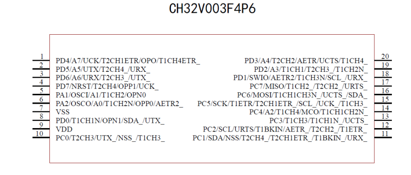

# WCH

This directory contains WCH (Nanjing Qinheng Microelectronics) microcontroller development boards and resources.

See [wiring.md](wiring.md) for general WCH (RISC-V) wiring and programming notes.

## Contents

### CH32V003-DEV-KIT
CH32V003 development kit based on RISC-V architecture. Contains:
 
- Development board schematics
- Datasheets and reference manuals
- Example projects with SSD1306 OLED display
- I2C communication examples

### CH32V003EVT
CH32V003 evaluation board examples including:
- GPIO, UART, SPI, I2C examples
- Timer and PWM examples
- ADC and DMA examples
- Flash programming examples
- System configuration examples

### CH32V003J4M6
CH32V003J4M6 variant examples including:
- Blink examples
- Neopixel WS2812 examples
- KiCad project files
 

### ch32v003f4p6-SignalGenerator
Complete signal generator project using CH32V003 and SI5351 clock generator chip. Includes:
- SI5351 driver implementation
- SSD1306 OLED display driver
- Documentation and schematics

### KiCAD
KiCad PCB design projects:
- CH32V003J4M6 development board
- Signal generator board design
- NE555 timer projects
- Gerber files for manufacturing

### Documentation
- CH32V003 datasheets and reference manuals
- WCH-Link programmer schematics
- Board pinout diagrams

All CH32V003 boards are based on RISC-V architecture, providing an open-source alternative to ARM Cortex-M0 microcontrollers.

